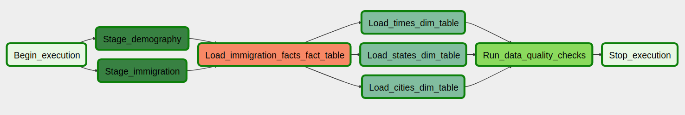

## Immigration data. DE Capstone Project

### Project Summary
We need to monitor immigration traffic among the cities. We may want to analize the dynamics of the population on the level of any state or city.

### Datasets

* **I94 Immigration Data**: 
This data comes from the US National Tourism and Trade Office. A data dictionary is described below. [This is where the data comes from](https://travel.trade.gov/research/reports/i94/historical/2016.html).

* **U.S. City Demographic Data**: This data comes from OpenSoft. You can read more about it [here](https://public.opendatasoft.com/explore/dataset/us-cities-demographics/export/).

### ELT Process

### Project tree

├── Capstone Project.ipynb
├── dags
│   └── immigration_dag
│       ├── dag_immigration.py
├── img
│   └── dag.png
├── plugins
│   ├── helpers
│   │   └── sql_queries_immigration.py
│   └── operators
│       ├── data_quality.py
│       ├── facts_calculator.py
│       ├── has_rows.py
│       ├── load_dimension.py
│       ├── load_fact.py
│       ├── s3_to_redshift.py
│       ├── stage_redshift_from_s3.py
│       └── stage_redshift.py
└── README.md

